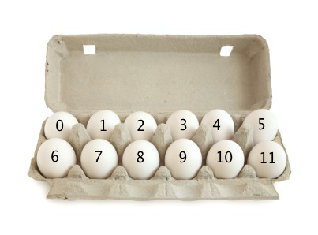

## Introduction to Arrays and its use cases 🚀

#### Day 1 - 19-08-2024

#### **📖 Concept of Arrays**

Arrays in Java are a collection of elements, all of the same type, stored in a contiguous memory location. They allow you to store multiple values in a single variable, making data management more efficient. Arrays are fixed in size and can be accessed using an index.

#### 🔍 Real time Example



#### **✨ Advantages of Arrays**

- **_Efficient Memory Usage_**: Arrays store elements in contiguous memory locations, leading to efficient data retrieval.
- **_Ease of Access_**: Elements can be accessed quickly using their index, making arrays ideal for scenarios requiring fast lookups.
- **_Data Management_**: Store and manage large volumes of data in a structured format.
- **_Fixed Size_**: Knowing the array size beforehand ensures better memory allocation and management.

#### **🌟 Use Cases of Arrays**

- **_Data Storage_**: Store a list of elements, such as numbers or strings.
- **_Matrix Operations_**: Represent matrices and perform mathematical operations on them.
- **_Sorting and Searching Algorithms_**: Implement and optimize algorithms for data sorting and searching.
- **_Handling Multiple Variables_**: Manage collections of similar data types, such as student grades or product prices.

#### **🛠️ Implementing Array Problems**

**_1. Peak Element Problem_**

Given a 0-indexed array of integers `arr[]` of size `n`, find its peak element and return its index. An element is considered to be a peak if its value is greater than or equal to the values of its adjacent elements (if they exist).

**_Constraints_**:

- 1 ≤ n ≤ 10⁵
- 1 ≤ arr[i] ≤ 10⁶

**_Expected Time Complexity_**: O(log(n))
**_Expected Auxiliary Space_**: O(1)

**_Example 1_**:

```java
Input: n = 3, arr[] = {1, 2, 3}
Output: 1
Explanation: The index 2 with value 3 is a peak element since it's greater than its adjacent elements.
```

**_Example 2_**:

```java
Input: n = 7, arr[] = {1, 1, 1, 2, 1, 1, 1}
Output: 1
Explanation: In this case, multiple indices could be peak elements. Returning any of them is correct.
```

**_Solve Here to Get Credits_**: [Geeks for Geeks - Peak Element Problem](https://www.geeksforgeeks.org/problems/peak-element/1)

**_2. Move Zeros Problem_**

Given an integer array `nums`, move all 0's to the end of it while maintaining the relative order of the non-zero elements. This must be done in-place without making a copy of the array.

**_Constraints_**:

- 1 ≤ nums.length ≤ 10⁴
- -2³¹ ≤ nums[i] ≤ 2³¹ - 1

**_Example 1_**:

```java
Input: nums = [0,1,0,3,12]
Output: [1,3,12,0,0]
```

**_Example 2_**:

```java
Input: nums = [0]
Output: [0]
```

**_Solve Here to Get Credits_**: [LeetCode - Move Zeros Problem](https://leetcode.com/problems/move-zeroes/description/)

#### **❓ Array Questions to Practice**

1. **_Peak Elements_**:

   - **_Objective_**: Find and return the peak element in an array.
   - **_Key Concept_**: Understanding array traversal and binary search.

2. **_Move Zeros_**:
   - **_Objective_**: Move all zeros to the end of the array without using an additional array.
   - **_Key Concept_**: In-place array manipulation.

#### **📚 Suggested Reading**

- [Arrays: A Step-by-Step Guide](https://www.geeksforgeeks.org/array-data-structure-guide/)

---
